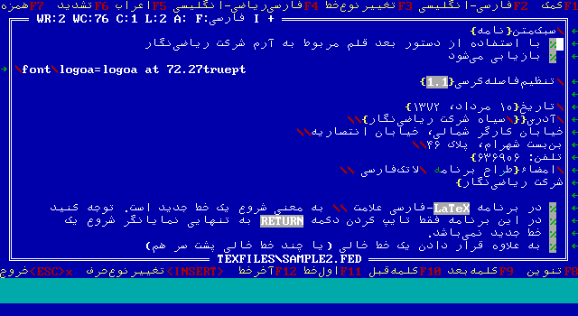
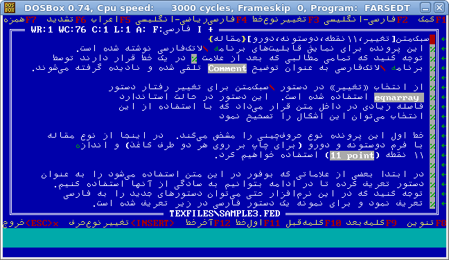
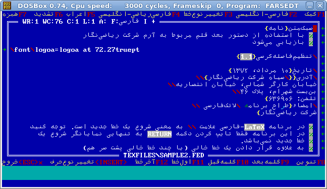
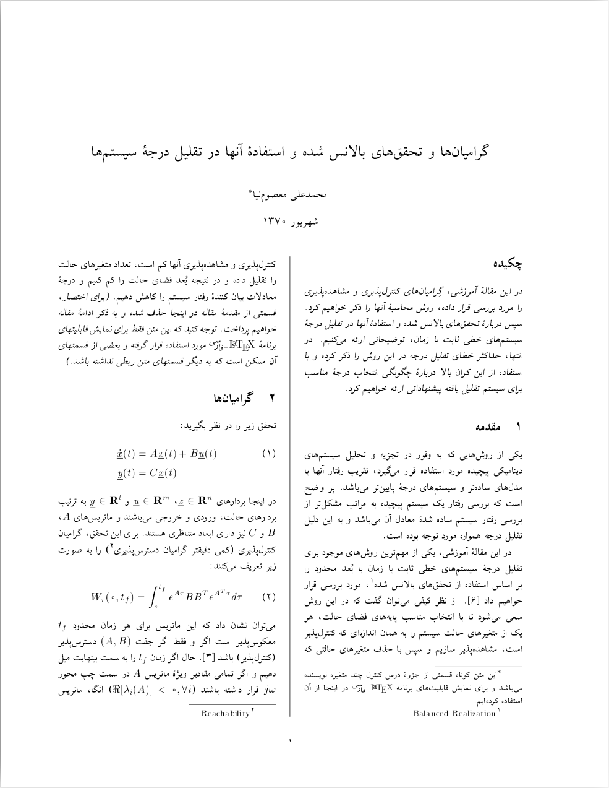
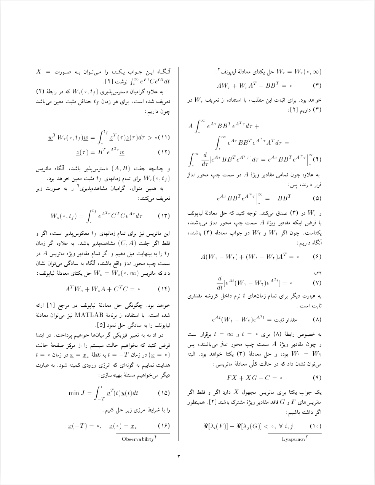
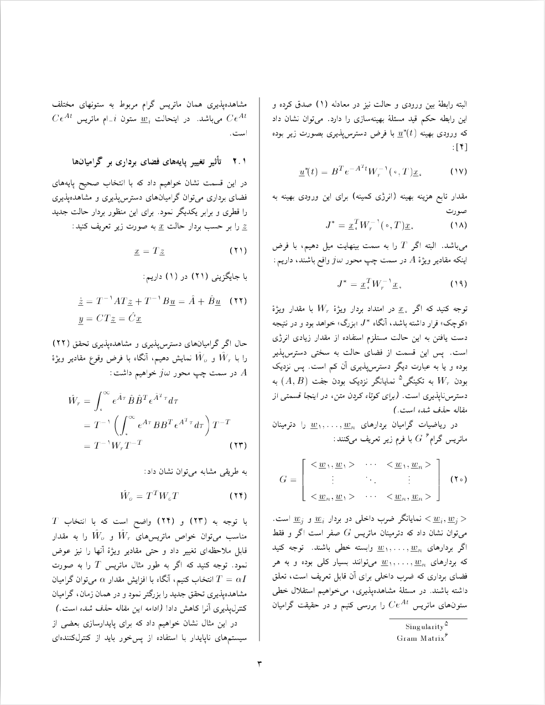

# LaTeX-e-Farsi (aka Riazi-Negar)

`LaTeX-e-Farsi (aka. Riazi-Negar)` is a Persian and English typesetting system based on Donald Knuth's TeX Program, developed by Professor Mohammad-Ali Ma'soumnia during 1990-91. It was one of the first commercial releases of TeX systems supporting RTL typesetting. It was prior to the other promising releases like `FarsiTeX` and 'TeX-e-Parsi`. As Ma'soumnia have no time to support his work, he released it for free. By the arrival of the other two successful mentioned releases of TeX, it had no chance to be used by a wide range of users, thus most Persian users of TeX have no memory of it. This bundle worked under MS-DOS.

## Editor

## Sample Output

